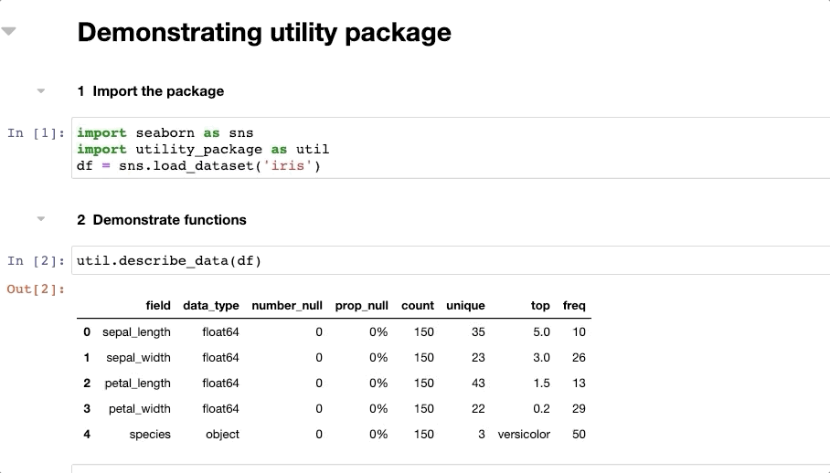

# Easy Manipulation



## What is it?
This package contains utility functions for quick data manipulation in pandas.

## Where to get it?
The source code is hosted in this repo. The pypi package can be found [here](https://pypi.org/project/easymanipulation/).

To use the package:
``` Python
pip install easymanipulation
import utility_pacakge as up
```
